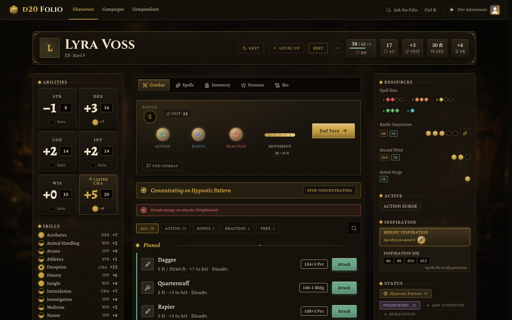
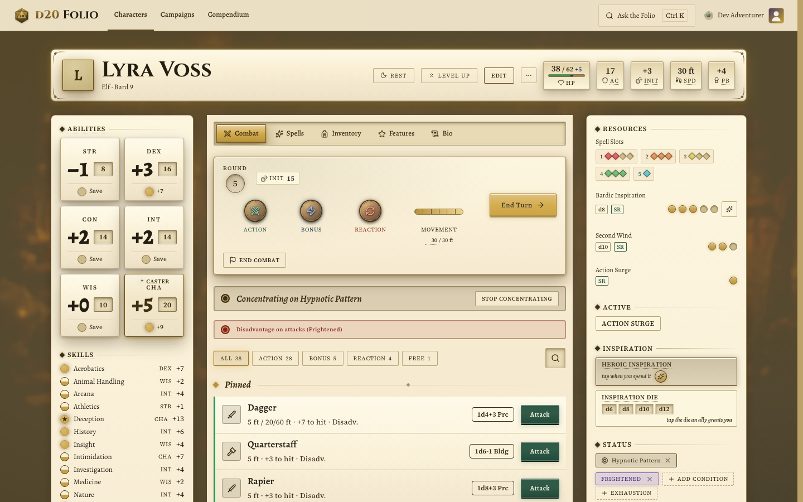
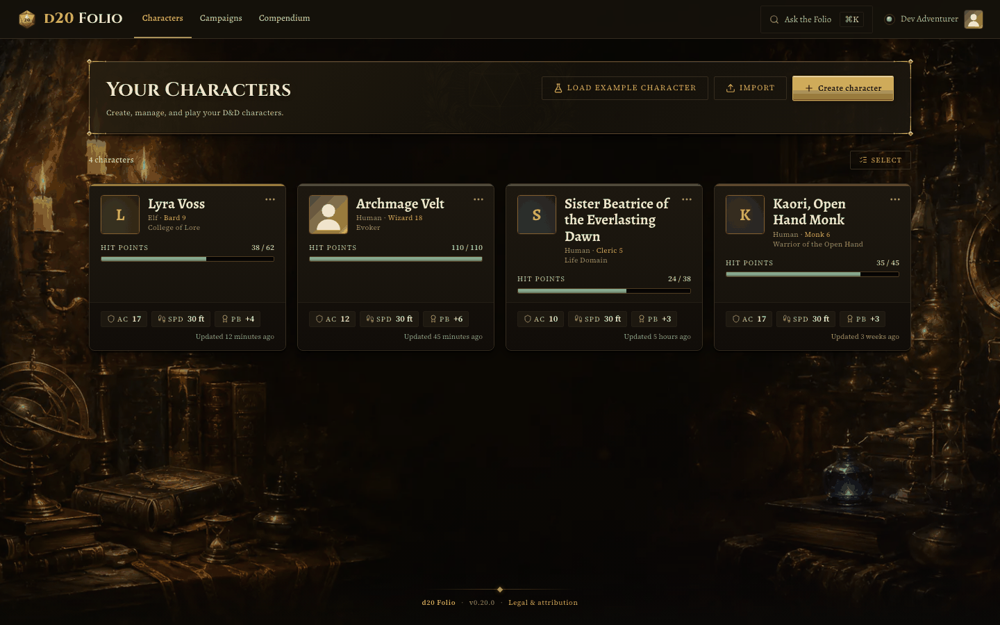
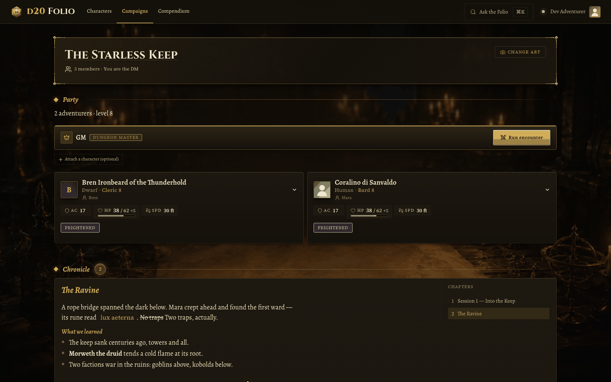

# d20 Folio

A free, bilingual (English + Italian) PWA for D&D 2024 players to create, level up, play, and manage characters and campaigns. Offline-first, with the complete 2024 SRD pre-loaded and every rule auto-computed.

[](https://github.com/salvodicara/d20-folio/actions/workflows/ci.yml)
[](./LICENSE)
[](https://d20-folio.web.app)
[](https://react.dev)
[](https://www.typescriptlang.org)
[](https://vite.dev)
[](https://firebase.google.com)
[](https://tailwindcss.com)
[](https://claude.com/claude-code)

## Purpose

d20 Folio is a free, bilingual (EN + IT), offline-first web app for playing Dungeons & Dragons 2024. It ships the entire 2024 SRD pre-loaded (classes, subclasses, spells, feats, species, backgrounds, equipment, magic items, conditions) and a rules engine that auto-computes every derived value, so the sheet stays correct as you build, level up, and play. It runs in the browser, installs as a Progressive Web App, syncs to the cloud through Firebase, and keeps working without a connection. The design goal is a sheet players trust over paper: a beautifully bound "Illuminated Folio" where the math is done for you but every computed value can still be overridden by hand.

## Live demo

Try it at [d20-folio.web.app](https://d20-folio.web.app). It requires a free Google sign-in (Google is the only auth provider); your characters are private to your account.

## Screenshots

<table>
  <tr>
    <td width="50%"></td>
    <td width="50%"></td>
  </tr>
  <tr>
    <td align="center"><em>Character cockpit (dark)</em></td>
    <td align="center"><em>Character cockpit (light)</em></td>
  </tr>
  <tr>
    <td width="50%"></td>
    <td width="50%"></td>
  </tr>
  <tr>
    <td align="center"><em>Roster</em></td>
    <td align="center"><em>Campaign hub</em></td>
  </tr>
</table>

## Features

- **Complete D&D 2024 SRD, pre-loaded.** Classes and subclasses, spells, feats, species, backgrounds, equipment (weapons, armor, gear), magic items, and conditions ship as static TypeScript data and are referenced by `srdId`, so SRD updates propagate everywhere.
- **Rules engine that automates mechanics, override-first.** Every mechanic-bearing fact is a typed `Grant` on the SRD data. `evaluateGrants` aggregates them and drives derived stats (AC, proficiency bonus, spell save DC, attack bonuses, passives) through `compute.ts`, trackers and actions through `smart-tracker.ts`, and level scaling through `level-up.ts`. Every derived value also exposes a manual override.
- **SRD-aware creation and level-up wizards.** The wizards suggest features, spells, and ability increases for you, applying 2024 rules correctly (background-based ASI, current 2024 species rules).
- **Character cockpit with play and edit modes.** Inline editing in place (no detours to sub-pages), plus an immediate-commit combat model with a cost engine, condition gating, and rich in-combat casting (upcast, free-cast, weapon mastery).
- **Campaigns and party play.** A campaign hub with shareable invite/join links, party view, DM tools, a shared treasury, shared notes, sessions, and a markdown Chronicle with chapters and version history.
- **Cloud sync and offline-first.** One Firestore document per character holds the sheet plus play state, with debounced auto-save (~2s, last-write-wins), Firestore offline persistence, and a Workbox service worker. Portraits live in Firebase Storage with runtime image caching.
- **Bilingual EN + IT throughout, light and dark at parity.** Localized via react-i18next, with accent-insensitive bilingual search. Both themes are designed, not adapted.
- **More tools.** An SRD Compendium browser, JSON character import, in-app bug reporting (screenshot plus debug context filed as a GitHub issue by a Cloud Function), PWA install, and an admin console.

## Tech stack

| Area          | Choice                                                                                                                                                                                                |
| ------------- | ----------------------------------------------------------------------------------------------------------------------------------------------------------------------------------------------------- |
| UI            | React 19, TypeScript (strict), Vite 8 (Rolldown bundler)                                                                                                                                              |
| Styling       | Tailwind CSS v4 (`@tailwindcss/vite`); design tokens in `src/index.css` and `src/styles/folio.css`                                                                                                    |
| Components    | Custom in-house component layer on Radix primitives (dialog, popover, tooltip, checkbox, radio-group, switch, slot). No shadcn package is installed; the components are hand-written folio components |
| Icons         | lucide-react, wrapped by `src/components/ui/icon.tsx`                                                                                                                                                 |
| Fonts         | @fontsource Cinzel (ceremonial titling), Alegreya (headings + body), Source Serif 4 (numbers/labels)                                                                                                  |
| State         | Zustand 5                                                                                                                                                                                             |
| Routing       | React Router 7 (data router, `createBrowserRouter`)                                                                                                                                                   |
| Backend       | Firebase 12 (Auth Google-only, Firestore, Storage, Hosting)                                                                                                                                           |
| Functions     | Cloud Functions in `functions/` (2nd-gen, Node 24, region `europe-west1`), a standalone npm package                                                                                                   |
| Offline / PWA | vite-plugin-pwa / Workbox                                                                                                                                                                             |
| i18n          | react-i18next / i18next (single `common` namespace, EN + IT)                                                                                                                                          |
| Testing       | Vitest 4 (unit + v8 coverage), Playwright (E2E, chromium; @axe-core/playwright for a11y)                                                                                                              |
| Tooling       | ESLint 10 + typescript-eslint, Prettier, @changesets/cli                                                                                                                                              |

### SRD-only by design

This repository builds a **fully-functional app on the SRD 5.2.1 dataset** (Creative Commons
Attribution 4.0 — see the attribution block below): clone it, install, and you get the complete
working product with every SRD class, subclass, spell, feat, species, background, and item. No
flags or configuration are needed — the `@pack` build seam (`scripts/content-pack-mode.ts`,
[docs/ARCHITECTURE.md](docs/ARCHITECTURE.md)) resolves by directory presence, and this tree has no
`content-pack/`, so `pnpm dev`, `pnpm test`, and `pnpm build` are the SRD-only composition by
construction. The maintainer's deployed instance composes a private content pack of additional
licensed-for-personal-use content through the same seam; that pack is not part of this repository
and is not required for anything here to work.

### Architecture in one breath

A character's effective stats are never parsed from prose. Every mechanic is a declarative `Grant` on the SRD data, `evaluateGrants(sources)` aggregates them, and the sheet reads the aggregated view. Adding a mechanic means adding a `Grant` kind, an evaluator branch, and a consumer, never a regex over English. This is the single seam between data and UI. See [docs/ARCHITECTURE.md](docs/ARCHITECTURE.md) and [docs/MECHANICS.md](docs/MECHANICS.md).

## Routes

Routes are defined in `src/app/router.tsx` (data router behind an auth guard and the app shell). Every route except the landing and login is code-split with `React.lazy`.

| Route                                      | Surface                                |
| ------------------------------------------ | -------------------------------------- |
| `/login`                                   | Sign-in (public)                       |
| `/`                                        | Redirects to `/characters`             |
| `/characters`                              | Roster                                 |
| `/characters/new`                          | Creation wizard                        |
| `/characters/:characterId`                 | Character cockpit                      |
| `/characters/:characterId/level-up`        | Level-up wizard (full screen)          |
| `/campaigns`                               | Campaigns list                         |
| `/campaigns/:campaignId`                   | Campaign hub                           |
| `/campaigns/:campaignId/sheets/:memberUid` | DM read-only member sheet              |
| `/join/:code`                              | Auto-join a campaign by invite code    |
| `/compendium`                              | SRD compendium browser                 |
| `/settings`                                | Settings                               |
| `/admin`                                   | Admin console (role-gated)             |
| `/legal`                                   | Legal & attribution (public, in shell) |
| `*`                                        | Not found (in shell)                   |

## Getting started

This repo pins its toolchain with [asdf](https://asdf-vm.com): Node 24.16.0 and Temurin 25 (the JDK the Firestore emulator needs). The root app uses **pnpm**; the standalone `functions/` package uses **npm** (never run pnpm there).

```bash
asdf install         # installs Node 24.16.0 + Temurin 25 from .tool-versions
pnpm install         # install root app dependencies

pnpm dev             # Vite dev server (real Firebase, no emulators)
pnpm dev:emulators   # dev against Firebase emulators (sets VITE_USE_EMULATORS=true)

pnpm test            # Vitest unit run
pnpm test:e2e        # Playwright E2E (chromium)
pnpm lint            # ESLint (the gate runs it with --max-warnings 0)
pnpm build           # tsc -b && vite build (production build)
pnpm preview         # serve the production build locally
```

Configuration goes in `.env.local` (uncommitted; copy from `.env.example`). The full local CI gate is:

```bash
pnpm tsc -b && pnpm lint --max-warnings 0 && pnpm test --run && pnpm build
```

Git hooks in `.githooks/` enforce this: pre-commit is fast (staged-file lint plus a changeset doc-guard), pre-push runs the full gate. A `justfile` collects common recipes.

### Deployment

The app deploys to Firebase Hosting at [d20-folio.web.app](https://d20-folio.web.app) (project `d20-folio`, region `europe-west1`). Deploys are always explicitly owner-triggered (never on push): `just deploy` runs the full gate + e2e matrix locally and deploys, or `gh workflow run deploy.yml` runs the same recipe on a GitHub runner. Hosting serves `dist/` as an SPA (rewrites `**` to `/index.html`), with `firestore.rules` and `storage.rules` for security; Cloud Functions deploy separately.

## Documentation

| Doc                                                          | What                                                                    |
| ------------------------------------------------------------ | ----------------------------------------------------------------------- |
| [CLAUDE.md](CLAUDE.md)                                       | Agent briefing and single source of truth for contributors (start here) |
| [docs/ARCHITECTURE.md](docs/ARCHITECTURE.md)                 | How the system works, from data to render                               |
| [docs/CONTRIBUTING.md](docs/CONTRIBUTING.md)                 | Local dev and contribution flow                                         |
| [DESIGN.md](DESIGN.md)                                       | The design system: tokens, type ramp, color, and rules                  |
| [PROGRESS.md](PROGRESS.md)                                   | Living roadmap and phase status                                         |
| [docs/PRODUCT_CONSTITUTION.md](docs/PRODUCT_CONSTITUTION.md) | Supreme product, UX, and design rules                                   |

## Contributing

Contributions are welcome — start with [docs/CONTRIBUTING.md](docs/CONTRIBUTING.md) (first-time setup, the gate split, and the common recipes). The short version: `asdf install`, `pnpm install`, `git config core.hooksPath .githooks`, and the pre-commit/pre-push hooks enforce the rest.

## How this was built

d20 Folio is 100% AI-written. Every line of application code, every test, and most of the docs were produced by Anthropic's Claude using [Claude Code](https://claude.com/claude-code), directed and supervised by the maintainer ([@salvodicara](https://github.com/salvodicara)) who set the product direction, made the decisions, and reviewed the behavior, but did not write the code by hand.

There is no human code review. The only quality gate is automated: TypeScript strict, ESLint at zero warnings, Vitest unit coverage thresholds, a production build, and a Playwright accessibility gate (`tests/e2e/a11y.spec.ts`) that runs axe across every surface in both themes and fails on any serious or critical issue. If it is green, it ships. The complete development journey lives in git history.

## Attribution and license

> This work includes material from the System Reference Document 5.2.1 (“SRD 5.2.1”) by Wizards of the Coast LLC, available at https://www.dndbeyond.com/srd. The SRD 5.2.1 is licensed under the Creative Commons Attribution 4.0 International License, available at https://creativecommons.org/licenses/by/4.0/legalcode.

> This work includes material taken from the System Reference Document 5.1 (“SRD 5.1”) by Wizards of the Coast LLC and available at https://dnd.wizards.com/resources/systems-reference-document. The SRD 5.1 is licensed under the Creative Commons Attribution 4.0 International License available at https://creativecommons.org/licenses/by/4.0/legalcode.

d20 Folio is an independent, unofficial, 5E-compatible tool and is not affiliated with or endorsed by Wizards of the Coast. The application code in this repository is licensed under the [MIT License](./LICENSE).
