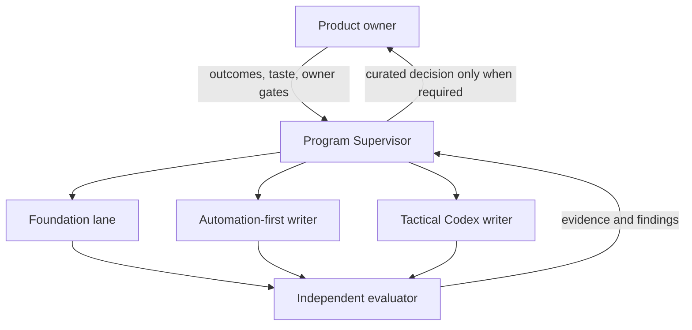

# d20 Folio Agent-First Operating Model — Design Specification

- **Status:** Approved for implementation
- **Direction approved:** 2026-08-25
- **Specification approved by owner:** 2026-08-26
- **Implementation gate:** satisfied on 2026-08-26; implementation proceeds under this specification's owner gates and work-in-progress limits
- **Scope:** public application repository, private content pack, Codex task topology, steering documents, skills/plugins, tests, integration, release readiness, and worktree lifecycle
- **Out of scope:** production deployment, live-data migration, product AI/LLM features, a VTT, and dice generation

## 1. Outcome

d20 Folio will use one durable program supervisor to drive two product programs to completion:

1. **Automation-first:** finish the deterministic rules and action automation already in progress.
2. **Tactical Codex:** implement the approved A00/B00-and-successor design system and application experience.

A short-lived **Foundation lane** maintains the engineering operating system that lets both programs move quickly without session drift. It is not a third product roadmap. It owns steering consolidation, task state, worktree hygiene, test economics, delivery safety, and the agent/plugin surface.

The target is maximum safe throughput, not maximum task count. Work is divided into small, independently verifiable slices; parallelism is limited by file ownership, dependency edges, and review capacity. A date never weakens the live-user, visual-approval, licensing, offline, bilingual, or deployment gates.

## 2. Product-owner interface

The owner acts as product manager. Agents own technical execution.

### Ask the owner only when

- a choice changes product outcome, scope, audience, or a durable user promise;
- a visual, interaction, or brand decision remains genuinely taste-dependent after the agent has produced a recommendation and evidence;
- privacy, cost, telemetry, a new external service, or third-party authority changes;
- an irreversible or destructive action, external publication, or deployment is ready;
- competing sources still imply materially different product intent after code, runtime, Git, tests, and history have been reconciled.

### Do not ask the owner about

- architecture, libraries, data structures, refactors, code organization, or implementation sequencing;
- which tests to write, repair, remove, or run;
- worktrees, branches, rebases, commits, CI, review routing, or documentation ownership;
- which skill, model, plugin, browser harness, or debugging method to use;
- technical quality trade-offs that evidence can resolve without changing product intent.

### Owner-facing communication

- Lead with the product outcome, current confidence, and any decision genuinely needed.
- Keep implementation detail in the program ledger, plans, commits, and evidence packages.
- Continue autonomously when no owner decision is needed; never park a program merely to ask whether to continue.
- Deliver visual gates as actual curated images with one clear recommendation, not local paths or technical narration.
- Treat “perfect” as an evidence standard: zero known release-blocking defects, mechanically enforced invariants, independent review, green risk-appropriate gates, and no knowingly deferred correctness problem. It does not justify speculative complexity or an unbounded search for theoretical perfection.

This contract is durable and must be linked from the active agent router during implementation so the owner does not need to restate it.

## 3. Control-plane architecture



### Program Supervisor

One persistent Codex task owns program scheduling and reconciliation. It runs on a scheduled heartbeat, reads durable state, compares it with Git and task reality, dispatches or resumes bounded subagent sessions, routes review, integrates eligible non-visual work, and cleans completed worktrees. Within an active turn it waits on running subagents; changes that occur between turns are discovered on the next heartbeat or explicit owner message. It never edits product code itself while supervising an active writer.

The heartbeat is intentionally conservative: **every 30 minutes while the program is active**, with at most two writers and one evaluator in flight. A heartbeat that finds no executable frontier records the reason and exits; it does not create busywork. Notifications are reserved for failed runs or owner gates.

The supervisor uses one execution mode only: it creates repository-managed worktrees under `~/Workspace/Codex`, then spawns bounded collaboration subagents into those exact absolute paths. It does not create separate user-owned Codex tasks for writers. Every writer charter names its absolute worktree, and every file or command action is rooted there; the supervisor verifies the worktree identity before dispatch and again before accepting evidence. This keeps task identity, Git identity, and cleanup ownership aligned despite subagents sharing the host filesystem.

### Product writers

Each writer owns one independently integrable outcome in one isolated worktree. A writer receives only the relevant specification, current task brief, exact dependencies, authoritative lease pointer, acceptance evidence, owner gates, and absolute worktree path. It does not inherit the entire program transcript and does not create its own reviewers.

### Independent evaluator

The evaluator is always read-only. It checks specification compliance and code quality from a prepared review package, then performs a final whole-branch review. Every fix is assigned to a writer and returns through a fresh evaluator pass. A writer’s self-review is useful evidence but never substitutes for independent review.

### Work-in-progress limits

- Maximum two active writers: normally one Automation-first and one Tactical Codex.
- Maximum one evaluator, reused across completed slices.
- Foundation changes that overlap either writer wait for the relevant lease.
- More sessions are created only when an executable, disjoint frontier exists. Session count is not a progress metric.

## 4. Durable state and authority

Chat history and model memory are never program authority.

### Versioned repository state

Implementation will establish the following small, linked surface:

- `AGENTS.md` / `CLAUDE.md`: short cross-harness router and non-negotiable safety rules;
- `PRODUCT.md`: current user, value, scope, non-goals, and brand direction;
- one consolidated constitution: durable product, licensing, safety, and live-user invariants;
- a compact map that links architecture, mechanics, schema, design, and runbooks;
- a compact current-status document with integration SHA, active milestones, blockers, owner gates, and delete zone;
- short ADRs for durable replacements, removals, and irreversible architecture choices;
- generated machine evidence for coverage and state that should not be duplicated by hand-maintained prose.

A fact has one document owner. Other documents link to it. Closed plans, rollout narratives, and superseded design identities move to history or Git rather than remaining in current maps.

### Runtime control state

Ephemeral orchestration state lives outside task worktrees under:

```text
~/Workspace/Codex/d20-folio-program/
  state/program.json
  state/leases.json
  ledger/events.ndjson
  handoffs/
  evidence/
  recovery/
```

- Every control-state file carries a `schemaVersion` and is validated before use. The supervisor is its only writer and updates snapshots atomically through write-and-rename; partial or invalid state is rejected.
- `program.json` is a reconstructible cache of the current machine-readable frontier, task identities, and last reconciled SHAs.
- `leases.json` caches only task identity, expiry, and a pointer containing the authoritative repository path, lease ID, and last reconciled blob/SHA. It never creates a second file/interface ownership model.
- `events.ndjson` is append-only and records dispatch, evidence, rulings, integration, cleanup, and owner gates.
- `handoffs/` and `evidence/` contain compact task packages, not duplicate product truth.
- `recovery/` contains verified capsules for intentionally retired dirty work.

Runtime state may point to repository facts but cannot override them. If a snapshot is missing or corrupt, the supervisor rebuilds it from the append-only ledger, current Git/worktree/task state, and the pinned repository authorities. Owner decisions are promoted into the appropriate versioned owner document or ADR. claude-mem may retrieve leads across sessions, but every lead is revalidated against current repository and runtime evidence.

## 5. Reconciliation loop: the anti-drift mechanism

Every supervisor wake performs the same loop:

1. Fetch public and, when relevant, private remotes without changing the shared checkout.
2. Inventory active Codex tasks, worktrees, branches, commits, dirty state, leases, and last evidence.
3. Compare the runtime ledger with Git, current owner documents, CI, test artifacts, and deployed-state evidence where authorized.
4. Resolve discrepancies by authority: latest informed owner decision; owning document; current code/config/runtime; relevant tests; then history for intent.
5. Update the owning state record in the same integration slice that changes the fact.
6. Select the smallest unblocked frontier, acquire its lease, and dispatch or resume exactly one writer for it.
7. Route completed work through independent review and verification.
8. Integrate eligible non-visual work from the task worktree, confirm the remote SHA, release leases, and remove the worktree.
9. Stop at visual approval, deployment, destructive non-migration operations, privacy/cost, or other owner gates; otherwise continue. Forward live-data migrations remain autonomous only after snapshot, dry-run, idempotent apply, and verify evidence is complete.

Task states are `queued`, `leased`, `executing`, `review`, `verification`, `owner-gate`, `integrated`, `retired`, or `blocked-with-evidence`. “In progress” without a lease, commit, test run, or explicit blocker is invalid state.

Each task charter contains:

| Field        | Required content                                                                                                                                               |
| ------------ | -------------------------------------------------------------------------------------------------------------------------------------------------------------- |
| Outcome      | One product or foundation result, stated without implementation trivia                                                                                         |
| Authority    | Exact specification and owner documents to read                                                                                                                |
| Dependencies | Required integrated SHAs and interfaces                                                                                                                        |
| Ownership    | Worktree, branch, files, generated outputs, and private-repo seam                                                                                              |
| Acceptance   | Observable behavior and risk-owned tests/evidence                                                                                                              |
| Review       | Task reviewer and final whole-branch reviewer                                                                                                                  |
| Owner gate   | Visual, privacy/cost, destructive/irreversible live-data operation, publish, or deploy; otherwise `none`. A protocol-complete forward migration records `none` |
| Cleanup      | Integration proof, document reconciliation, recovery need, and removal action                                                                                  |

## 6. Development lifecycle

Superpowers is the single development lifecycle:

1. product discovery and design;
2. approved written specification;
3. executable implementation plan;
4. isolated worktree;
5. test-driven implementation;
6. systematic debugging for every unexpected result;
7. scoped independent review and fix loop;
8. verification before completion;
9. repository-specific integration and worktree retirement.

ECC skills remain specialist tools, not a competing lifecycle. A task uses the smallest non-overlapping set of skills that improves its outcome.

Ponytail applies after product design is settled: remove accidental complexity, dead code, speculative abstractions, redundant dependencies, and duplicate mechanisms without lowering correctness. Refactoring is expected when evidence shows a simpler or safer architecture; churn for its own sake is rejected.

## 7. Worktrees and two-repository safety

### Public repository

- The shared checkout remains clean on `main` and is never used for task edits or branch switching.
- Every writer starts from freshly fetched `origin/main` in a task worktree physically under `~/Workspace/Codex` on this host. The supervisor owns creation and cleanup; the assigned subagent owns only the branch contents.
- A task branch may be removed only after its unique state is integrated, preserved in a verified recovery capsule, or proven empty/patch-equivalent to integrated history.
- App-managed worktrees are first detached from their Codex task through the app handoff flow; orphaned, clean directories may then be removed explicitly.
- Dirty worktrees are never force-removed before a manifest, complete Git bundle, binary-safe tracked patch, untracked archive, checksums, and source-match verification exist.

The current `origin/main` `wt-new` recipe already installs both root and standalone Functions dependencies. The observed bootstrap failure came from invoking an older recipe in the stale shared checkout, while the Claude setup shorthand also omits the standalone package. Foundation will replace this ambiguity with one idempotent supervisor bootstrap, executed from the freshly created target worktree with the pinned Node 24.16.0 toolchain. `just wt-new` remains the manual/same-thread adapter; it is not a second supervisor writer mode.

### Private content pack

- Read-only composed verification may use the clean private `main` checkout through the worktree link.
- Any task that edits private content creates a dedicated private worktree and a paired public verifier worktree. It never edits the shared private checkout.
- A public API or behavior change that touches the pack seam updates and verifies both repositories in the same tranche.
- A two-repository charter records the public and private base SHAs, compatibility direction, integration order, and final verified SHA pair. Changes stay forward- and backward-compatible across the chosen push order. The second repository is pushed only after the first is confirmed; if it fails, both worktrees remain intact and the charter executes its predeclared rollback or disposition before any cleanup. A pack-only change still requires a fresh paired public verifier.
- Both composed and SRD-only gates remain green. Public SRD data and private non-SRD content never cross the licensing boundary.
- Private content, credentials, and secrets never enter public recovery capsules, task memory, logs, or screenshots.

No private source change is required by this specification or by the current K1, B00, and T8A worktree recovery.

## 8. Worktree status ownership

This durable design contains policy, not a snapshot of temporary branches. The dated [2026-08-25 worktree consolidation record](../superpowers/status/2026-08-25-worktree-consolidation.md) owns the audited inventory, recovery checksums, cleanup evidence, and then-current disposition. Future reconciliations append dated status records or replace the current status owner; they do not edit this design merely because a task advances.

## 9. Test portfolio and quality gates

Test value is measured by defect detection and feedback quality, not by test count or coverage theater. Every test family is periodically evaluated using Google’s SMURF dimensions: speed, maintainability, utilization, reliability, and fidelity.

### Inner loop

- One failing regression or behavior test is observed before a bug fix or feature implementation.
- Run the smallest type, lint, unit, integration, rules, Functions, or browser command that exercises the changed contract.
- A test that can pass while the required behavior is broken is repaired or removed.
- Flaky retries do not define green; root causes are diagnosed and the covering lane reruns without hidden retries.

### Integration loop

- `just ci` is the authoritative composed local gate.
- `just ci-srd-only` is mandatory whenever the licensing seam or public composition may be affected.
- Rules changes also run `pnpm test:rules`.
- Visual changes run the isolated curated, motion, accessibility, responsive, locale/theme, and performance evidence appropriate to the affected surface.
- A gate runs with the pinned toolchain and both root and standalone Functions dependencies installed.

### Test deletion

A slow, duplicated, vacuous, source-shape, or low-fidelity test is deleted only after the real failure cause is mapped to a faster or more faithful replacement. The replacement is mutation- or detector-checked where practical. Deletion ledgers record failure cause, replacement, evidence, and timing impact. Broad suites that only add elapsed time without unique defect detection are not protected by age or volume.

### Release readiness

Deployment remains explicitly owner-triggered. Before asking for that gate, Foundation must close the current operational gaps with a documented release manifest, post-deploy smoke evidence, rollback target/procedure, and live-user verification. Open critical/high dependency alerts must be patched or carry reviewed reachability and compensating-control evidence; a package is not dismissed merely because its current path appears build- or development-only. Preview channels are optional and must be treated as public URLs connected to real backend resources unless safely pinned or emulated.

## 10. Skill, plugin, and memory policy

Installing or invoking every available tool would increase context, permissions, overlap, and drift. The optimum is a small primary stack with evaluated specialists.

| Need                    | Primary mechanism                              | Policy                                                                                  |
| ----------------------- | ---------------------------------------------- | --------------------------------------------------------------------------------------- |
| Development lifecycle   | Superpowers                                    | Always authoritative for spec → plan → worktree → TDD → debug → review → verify         |
| Product direction       | Product Lens / focused research                | On demand before a material product commitment                                          |
| UI/UX                   | repo Impeccable                                | Primary for all visual work; read Product, Constitution, and Design first               |
| Visual implementation   | Image-to-Code plus browser/Playwright evidence | Only for visually important slices and only after approved design authority             |
| Browser QA              | Playwright/browser QA                          | Repeatable tests first; Chrome only when the user’s signed-in browser state is required |
| Security                | Security Review                                | Auth, input, secrets, API, Firebase, and sensitive changes                              |
| Architecture/navigation | Graphify                                       | Only when a current graph exists or is intentionally generated; index, never truth      |
| Cross-session leads     | claude-mem                                     | Searchable context only; verify every claim; no secrets; cloud sync remains opt-in      |
| Process improvement     | Task Observer                                  | External stable log; reviewed in batches, never allowed to interrupt delivery           |
| Simplicity              | Ponytail / Ponytail Review                     | Apply after intent is settled; remove over-engineering without lowering the bar         |

Foundation bootstrap will:

- update or disable the obsolete `codebase-simplifier` agent whose PR workflow and gates conflict with this repository;
- choose one canonical copy per harness for duplicated skills, especially Impeccable;
- measure claude-mem’s always-on hooks before retaining them;
- narrow ambiguous design/browser routing;
- keep the monolithic ECC plugin disabled;
- install no recommended external plugin without a concrete workflow, permission review, overlap check, and representative eval.

The audit produces one decision ledger, not another tool framework. Every retained, replaced, disabled, or newly installed skill/plugin records its purpose, source reputation and freshness, before/after context cost, permissions, overlap, representative evaluation, and owner-impact. Acceptance requires equal or better task success with lower or justified context/permission cost; otherwise the existing surface remains unchanged.

GitHub, Figma, and Codex Security remain candidates only if a program slice proves a need not already covered by Git/CI, the atlas/repository, or the existing security skill. Task managers, trading, media, and unrelated productivity plugins are outside this program.

## 11. Program sequencing

### Pinned program authorities

Initial task charters reference the exact path and Git blob below rather than duplicating either roadmap. A changed blob forces reconciliation before another dependent slice is leased.

| Authority                                   | Path                                                                  | Pinned blob at base `5e19d43`              |
| ------------------------------------------- | --------------------------------------------------------------------- | ------------------------------------------ |
| Automation-first roadmap and exit checklist | `docs/superpowers/plans/2026-08-25-automation-first-wayfinder.md`     | `44560c49a166dbd897fff2d316cb3b17b6a1aef5` |
| Tactical Codex roadmap and exit checklist   | `docs/superpowers/plans/2026-08-25-tactical-codex-ui-ux-wayfinder.md` | `062ffd48783311a77e1ad5bee962ef5cd637c079` |
| Test-portfolio reset roadmap                | `docs/superpowers/plans/2026-08-25-test-portfolio-reset.md`           | `9f3e42f7e50f104a35ceab21f5469a4291407bb4` |
| Current shared-path lease/status authority  | `docs/TEST_PORTFOLIO.md`                                              | `abd233538f56877fcdc649492f65bf7b35f18f7c` |
| Automation readiness baseline               | `docs/superpowers/plans/2026-08-25-g0-automation-readiness.md`        | `0a7f1ec661390aa475dfbde83eab72a4fbbe8b89` |

The initial Foundation, Automation-first, and Tactical Codex charters each record this authority manifest, their exact base SHA, the relevant roadmap exit rows, their first lease, and their program-level completion checklist. The current Automation-first Wayfinder still over-gates safe migrations; Foundation reconciles that wording with Golden Rule 22 before leasing a migration slice, without changing the migration safety protocol.

### Foundation bootstrap

1. Ratify and link this operating contract.
2. Create the validated external control state and one Program Supervisor heartbeat task.
3. Consolidate the agent router, document roles, current status, delete zone, and ADR surface.
4. Make worktree/bootstrap reproducibility independent of stale shared-checkout recipes, including Functions dependencies and pinned toolchain use.
5. Complete the skill/plugin/context reductions and remove conflicting instructions.
6. Close or evidence-disposition the open high-severity dependency findings recorded in the [2026-08-26 Foundation security baseline](../superpowers/status/2026-08-26-foundation-security-baseline.md), with production/build/development reachability verified rather than inferred.
7. Ratify the risk-owned test portfolio and close release smoke/rollback gaps.

Foundation slices are small and integrate early; the lane does not become a months-long platform rewrite.

### Automation-first frontier

1. Review and verify K1 from its clean three-commit branch.
2. Integrate K1 only after scoped and whole-branch review plus composed/SRD evidence.
3. Reconcile the automation coverage owner and select the next deterministic gap by player impact and dependency order.
4. Continue in small automation slices until declared mechanics, state transitions, undo, import boundaries, and private composition meet the program exit criteria.

### Tactical Codex frontier

1. Complete, review, and integrate the T8A visual-runtime fix.
2. Rebase B00 on the integrated visual foundation and rerun the complete visual lane.
3. Deliver the curated B00 evidence to the owner as images with a recommendation.
4. After approval, integrate B00 and execute the A00–A16/B01 slices in dependency order, using one shared design system and one surface census.
5. Remove the superseded visual identity only after parity and approved evidence; never run two production design systems indefinitely.

The Automation-first and Tactical Codex writers may run concurrently when their leases are disjoint. Integration and review remain serialized at the shared boundary.

## 12. Program exit criteria

The operating model is successful when:

- a fresh supervisor session reconstructs current program state from versioned and machine-readable evidence without relying on chat memory;
- no active task lacks an owner, lease, dependency SHA, acceptance evidence, or cleanup rule;
- no obsolete worktree or dirty experiment survives without an explicit disposition and recovery proof;
- technical questions are resolved by agents and evidence, while the owner sees only product outcomes and genuine owner gates;
- test time and flakiness trend down without reducing unique defect detection;
- public and private compositions stay compatible and license-safe;
- non-visual slices integrate continuously, visual slices pass screenshot approval, and deployment remains a separate explicit owner action;
- the new Tactical Codex experience and automation-first mechanics are complete across supported locale, theme, viewport, offline, accessibility, and live-user safety contracts.

## 13. Evidence basis

This design adapts authoritative practices rather than copying a generic multi-agent pattern:

- OpenAI’s [Harness engineering](https://openai.com/index/harness-engineering/) reports that agent-first teams need repository-legible context, short routing documents, mechanically enforced boundaries, isolated worktrees, direct UI/log evidence, and continuous entropy cleanup.
- OpenAI’s [Agents SDK evolution](https://openai.com/index/the-next-evolution-of-the-agents-sdk/) reinforces checkpointable state, controlled execution environments, and separation of durable harness state from disposable compute.
- DORA’s [DevOps capabilities](https://docs.cloud.google.com/architecture/devops) and [generative-AI research](https://dora.dev/research/ai/gen-ai-report/dora-impact-of-generative-ai-in-software-development.pdf) support small batches, work-in-process limits, rapid feedback, automated testing, maintainability, and reliable delivery rather than raw code throughput.
- Google Testing Blog’s [SMURF](https://testing.googleblog.com/2024/10/smurf-beyond-test-pyramid.html) provides the test-portfolio criteria used here instead of a fixed pyramid or “more tests is better” rule.
- Firebase Hosting documents [local testing, preview channels, deployment, and rollback](https://firebase.google.com/docs/hosting/test-preview-deploy), supporting a release flow that separates verified integration from explicit production release.

The repository’s live-user, bilingual, offline, no-dice, licensing, zero-cost, screenshot-approval, and owner-triggered deployment invariants remain stricter than any generic source and therefore prevail.
