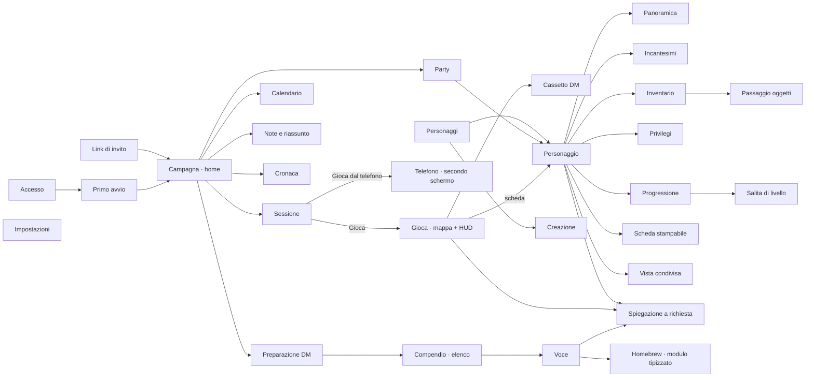

# UI redesign — design vision and component rules

Status: in progress, owner-directed (session of 2026-09-02/03). This document is the owner of the
redesign's visual vision, its information code, and the component rules. It supersedes the
Tactical Codex atlas and the Illuminated Folio grammar as _visual authority_ once the owner
approves screenshots surface by surface (golden rule 25). Until then the shipped app remains the
production owner.

## 1. Owner decisions recorded (2026-09-02/03)

1. Register: the fantasy atmosphere stays; "premium" means professional craft, not decoration.
   Every ornament must carry meaning; random spacing, padding or decoration is a defect.
2. Method: do not reinvent. Study the category leaders and comparable premium products with their
   real screens, copy their component grammar, and re-clothe it in one coherent vision. The
   references are, in order: Baldur's Gate 3 (the actual game UI), D&D Beyond (the public example
   sheet), then Demiplane, Roll20, Foundry, Alchemy, Shard, and games with strong tactical UI
   (Solasta, Divinity: Original Sin 2, Pathfinder: Wrath of the Righteous, Hades).
3. Information code: copy Baldur's Gate 3's action economy signs (see §4) and encode spell levels,
   slots, schools, damage types, advantage/disadvantage, rarity and conditions so the interface can
   be scanned rather than read.
4. Progressive disclosure is mandatory and must never regress: every non-obvious term, value or
   icon (Classe Armatura, slot, movimento, competenza, concentrazione, a condition, a damage
   icon…) explains itself on demand, everywhere. A row shows a sign, a name, at most three numbers
   and one verb; everything else is one tap away.
5. Approved from screenshots: the component dossier method (2026-09-03) and component 8,
   explain on demand, in the Classe Armatura breakdown form (2026-09-03).
6. Scope: the whole product, in light of total combat automation (reaction windows, declared
   table facts, shared undo log, non-PC entities). Deliverables proceed surface by surface with a
   component dossier each; the owner judges only visuals, delivered as chat images.

Decisions of the morning of 2026-09-03 (grill of ten scenario questions; the owner's answers are
verbatim in the session and summarised here). They change the product's premises and supersede
§6b's recommendation:

7. **Ultimate goal (owner, verbatim intent):** "a thing like Baldur's Gate 3, but for playing
   D&D" — this is why the app exists. BG3 is the product model for play, not only a UI reference.
8. **Primary use case is online play:** each player on their own computer with voice on Discord.
   The physical table is a secondary extension, still served (phone + a shared display).
9. **Built-in map at Owlbear level:** background image, tokens, ruler, simple manual fog, grid;
   no walls, dynamic vision or lighting. The app derives reach, bands, movement events and area
   membership from token positions. The DM must be able to do everything Owlbear Rodeo 2 does
   today (scenes, layers, hidden tokens, drawing, pointer, measurements) so nothing is done twice.
   The Owlbear-bridge recommendation (§6b, option B) is rejected.
10. **Dice in-app by default** with a shared 3D animation everyone sees (Owlbear-like); physical
    dice with manual input as a per-user option; the DM can roll hidden. The "never rolls dice"
    invariant is revoked (constitution §2.2, golden rule 21, `CLAUDE.md`).
11. **Total automation with audit:** the app applies every consequence by itself (damage, 0 HP,
    conditions, resources, log line); the DM — and anyone — can undo or correct afterwards; the
    log records who did what.
12. **Homebrew through guided typed forms** that the app enforces (Foundry/Shard-style editors)
    plus campaign rule toggles (e.g. critical on 19–20). Free text is not a mechanic.
13. **Play screen = BG3 HUD on a full-screen map:** the hotbar of the acting creature at the
    bottom, the initiative strip on top, the sheet opened on demand for detail; panels appear
    only when needed. The sheet's separate combat mode disappears; the hotbar is the combat
    surface.
14. **The DM uses the same play screen:** selecting a creature swaps the hotbar to that creature
    (BG3 party-switch pattern) plus a collapsible DM drawer (log, fog, hidden things, scenes).
15. **Desktop is the primary play surface;** the phone is a second screen (sheet, hotbar, dice)
    and the out-of-session device; the map is viewable on the phone but not designed for play.
16. **Map storage copies Owlbear's free tier:** upload with automatic compression, a per-campaign
    quota, free tier only, the £1 kill-switch armed; when full, the DM deletes maps to make room.
17. **Staged rollout:** new sheet and look first, then the play screen with map and dice; every
    stage approved from screenshots (golden rule 25); Owlbear stays in use until our map is ready.
18. **The DM has the last word (owner, 2026-09-03, on approving dossier 14 as direction).** The
    DM must be able to do everything Owlbear allowed and, everywhere, override any value, rule or
    outcome for homebrew and rulings; the app proposes and applies, the DM decides, and the app
    never decides over the DM. Every automatic result stays editable in place, with undo, and no
    surface may block the DM behind a computed value. Play screen (dossier 14) approved as visual
    direction on 2026-09-03 with this condition.

## 2. Vision, in one paragraph

Dark, warm, near-opaque panels edged with a thin gold hairline and small bracket corners; ivory
serif text; section titles centred between two fading hairlines; icons as coloured glyphs inside
dark tiles; the portrait in a round gold ring with the life bar beneath; cyan reserved for "your
turn / selected"; one gold primary control per screen. No painted scene behind content: the
atmosphere comes from the warm palette, the serif, a radial vignette, and the framed panels. This
is Baldur's Gate 3's atmosphere carrying D&D Beyond's information architecture.

## 3. Tokens (mockup values; the implementation maps them onto `src/index.css`)

- Spacing scale: 4 · 8 · 12 · 16 · 20 · 24 · 32 · 40. Nothing else.
- Radii: 4 (controls), 6 (panels), pill (chips, tabs, primary button).
- Surfaces: canvas `#0d0b08` with radial vignette; panel `rgba(22,18,12,.94)`; raised `#1c1711`;
  well `#0a0806`.
- Ink: `#efe6d3` primary, `#c8bda6` secondary, `#93887a` muted, `#5f584d` dim.
- Hairlines: `rgba(240,225,190,.09)` and `.15`; gold line `rgba(201,163,90,.42)`; gold dim `.22`.
- Gold: `#c9a35a`, light `#e6cc8a`. Cyan (current/selected): `#62d4e8`. Danger `#d8635a`.
  Vitality `#5fb08a`.
- Type: Alegreya (UI and body, tabular lining numerals), Cinzel (character name, hero numbers,
  page titles only). Labels 11px/600/.12em caps; body 15; row title 16/600; hero name 26 (phone)
  · 34 (desktop); HP number 20–34 in Cinzel.
- One border weight (1px). Depth by tone, never by shadow, except the portrait ring and the primary
  button.

### 3b. Icon system (2026-09-03)

Glyphs are never hand-drawn. Two licensed sets, normalised into one sprite (24 px viewBox):
game-icons.net (CC BY 3.0; authors lorc, delapouite, skoll, sbed, carl-olsen, willdabeast) for
game glyphs — weapons, damage types, schools, conditions, sheet values, map objects — rendered as
filled `currentColor` shapes; Lucide (ISC) for interface glyphs — tools, chevrons, eye, lock,
layers, search, undo — rendered as 1.75 px strokes. Attribution text (EN and IT) ships in the
app's credits. The action-economy signs (§4) stay in-house geometric marks. Sprite and licence
notes: `~/.agents/state/d20-folio/design-2026-09/mockups/icons3/` (to be moved into
`src/assets/icons` at build time).

## 4. Information code (shape + colour, never colour alone)

- Action economy, from Baldur's Gate 3: action = teal-green circle `#3ec5a5`; bonus action =
  orange triangle `#f0a33a`; reaction = magenta hexagon `#e05fa0`; movement = blue square
  `#4aa8e0`; free = hollow circle. Spent = same shape, hollow. The sign appears on the turn pill,
  in filters, in the corner of every action tile, and as the colour of the action's button.
- Spell level: roman numeral in a small gold-hairline chip; cantrip = dashed chip. In lists the
  level is the section title and is not repeated per row.
- Spell slots: filled/hollow diamonds per level, brass. School: coloured dot before the name.
- Damage type: icon + colour beside the formula (fire, cold, lightning, acid, poison, necrotic,
  radiant, psychic, force, thunder; physical types share ivory with sword/arrow/hammer icons).
- Advantage / disadvantage: arrow-up green / arrow-down red chip beside the value it modifies.
- Rarity: name colour (common ivory, uncommon green, rare blue, very rare violet, legendary orange).
- Conditions and buffs: 30px chips with a coloured icon medallion (gold beneficial, red condition),
  neutral text, duration in small type. Concentration carries the spell name and rounds left.

## 5. Component rules (cockpit dossier v1, 2026-09-03)

1. Identity and HP: round portrait with gold ring and level roundel; name in Cinzel; lineage line;
   HP current large, max and temp small on one line; life bar beneath with temp hatched in gold.
   Tapping the bar or number opens the HP editor; no loose − / + in the panel.
2. Statuses: chips under the name; tap opens rule, active effects and Remove; consequences live
   on the values they modify.
3. Abilities: phone and panel use the Baldur's Gate 3 compact row (gold abbreviation, modifier
   large, score small, dot = proficient save, diamond = spellcasting ability); desktop rail uses
   D&D Beyond's shaped tablets with the same content.
4. Vitals: shield = AC, octagon = initiative, plate = speed, hexagon = proficiency, circle = spell
   DC; one gold hairline, dark fill, Cinzel number, full-word label beneath. Tap opens breakdown
   and override.
5. Turn: Baldur's Gate 3 economy pill; "Fine turno" is the only solid gold button and carries the
   round number; on phone the turn bar is fixed above the bottom navigation.
6. Actions: dark tile with glyph and economy dot, name, advantage arrow, range and bonus, typed
   damage, button in the economy colour; everything else in the detail sheet. Filters use the
   economy glyphs. Tabs are pills.
7. Sections and panels: title centred between two fading hairlines with the live fact in small
   type; panels with a gold hairline and 12px bracket corners; brackets only on primary panels.
8. Explain on demand (specified from the tooltip research of 2026-09-03; sources in the research
   file kept with the design artifacts): one primitive with four kinds — term, stat, icon,
   resource — that never carries prose itself but points at an explain entry resolved through
   i18n, so the same entry serves every surface in EN and IT.
   - Anatomy, in fixed order: header (icon, name with abbreviation, kind chip) · value line
     (number or dice, economy glyphs, range) · in brief (one plain sentence) · rule (at most
     three bullets: effect, when it ends, edge cases) · for you (one computed line) · where it
     comes from (breakdown rows with source, override row flagged) · related keywords ·
     footer "Apri nel compendio". Sections 3–4 are mandatory for terms; 2 and 6 for stats and
     resources; 1 and 3 for icons.
   - Containers: desktop popover (hoverable, pinnable on click or Enter, persistent, Esc closes,
     max 320px, arrow to trigger, never covers the trigger); phone modal bottom sheet with two
     detents (peek: header and in-brief; full: everything). Never a popover on phones.
   - Triggers: hover after about 450ms and keyboard focus on desktop; tap on a dedicated trigger
     on touch; long-press only as an enhancement. Terms carry a dotted gold underline; stats
     show an info affordance on hover, always on touch.
   - Nesting: keyword chips replace the panel content in place with a back breadcrumb (depth
     two at most); anything further routes to the compendium. Only one pinned panel at a time.
   - Advanced layer: a "Dettagli" disclosure inside the panel (and hold-Alt on desktop) reveals
     formulas; there is no global setting that hides or shows breakdowns.
   - Abbreviations: the first render per screen shows the full word with the abbreviation once
     (Classe Armatura (CA)), then the abbreviation with the trigger; compact cells always use
     the abbreviation plus trigger; an opt-in setting "Etichette estese" forces full labels.
   - Teaching tips (auto, once, per-user seen state, resettable, one at a time, never modal)
     are separate from reference explains, which are always on demand and can never be hidden.
   - Accessibility: WCAG 1.4.13 dismissible, hoverable, persistent; no native title tooltips;
     no interactive content inside hover-only tooltips; focusable triggers; expand-on-first-use
     for abbreviations. Panels show formulas and modifiers only; they never roll or suggest a
     result.

### 5b. Additions from the wider reference study (Solasta, Divinity 2, Pathfinder WotR, Hades,

Foundry, Roll20, Demiplane, Alchemy, Shard, Owlbear, Kanka, LegendKeeper; 2026-09-03)

- HP state colours the whole component, not an icon: below half the bar turns amber, below a
  quarter the bar and numeral turn red with a soft glow (Hades, Foundry). Temporary HP and
  armour-like layers are slim stacked bars above the main bar (Divinity 2).
- Conditions have two renderings: a strip of shaped icons with a duration overlay attached to the
  identity block (BG3, Hades) for compact surfaces such as the initiative strip and combatant
  cards, and the readable chips of §5.2 inside the sheet.
- Initiative: a top strip of portrait chips in turn order; the active chip is enlarged, named and
  outlined in cyan; side colour gold for allies and red for enemies; a round divider marks where
  the round resets; HP bar under each chip. On narrow screens the strip becomes a list with the
  active row tinted (Owlbear).
- Roll entry (the app never rolls): the card shows the formula field first and the result box
  second, with the computed total and the verdict chip (hit, miss, critical) coloured (Foundry
  roll request, Solasta combat log).
- Tooltip text hierarchy from Divinity 2: title, small caps category, number-first lines with an
  icon, blue for bonuses, ivory for requirements, muted footer; nested terms as chips (Foundry).
- Ability tiles: the modifier is the dominant number; the score is secondary. Sign may be
  reinforced by the pill colour only in addition to the sign glyph, never instead of it.

### 5c. Position and movement without a map (research of 2026-09-03, 49 sources)

- Every distance-dependent 2024 rule reduces to four facts: within reach (binary), one ordinal
  range band, cover per target, and set membership for areas. The dominant pattern in shipping
  map-less companions is "no position at all"; where products go further they use tags and
  bands (Daggerheart, 13th Age, theatre-of-the-mind trackers), never coordinates.
- Model (sharpening the combat spec §2.3, to be ratified by that spec's owner): `engaged` and
  `adjacent` as sticky binary facts; a `band` relation with five classes — reach (≤1,5/3 m),
  near (≤9 m), medium (≤18 m: the most common spell range and Counterspell), far (≤36 m),
  distant — replacing the four-band ladder; cover per target; visible (default true); aura
  membership; and optional DM "spots" (named tags carrying difficult/cover/obscured defaults).
  Defaults: explicit pair → spot → global (near, no cover, visible).
- Declarations are sticky and made on the turn that changes them, never per attack: Engage X
  (implicit in any melee attack), Break away from X, Disengage, Move toward / away / to spot (one
  band step; Dash two; difficult spot halves), Cover from X or all, Hidden from X, Next to ally.
  The DM adds pair overrides, "everyone near" reset, spots, forced movement (no opportunity
  attack), and "resolve for an absent player".
- Reaction windows opened automatically from those facts: opportunity attack on leaving reach
  (filtered by Disengage, teleport, forced movement, visibility); Shield only when the roll is
  within five of the AC; Counterspell for casters within medium band and visible; readied
  actions authored as event subscriptions; Uncanny Dodge, Cutting Words, Protection via
  adjacency; emanation entry prompts. Windows open on the reacting device only, show the
  triggering fact and the cost, count down, and can be resolved by the DM for an absent player;
  each reaction keeps an Always / Ask / Never preference (Baldur's Gate 3).
- UI (dossier component 12): per-hostile band chips under the initiative strip with a tap sheet
  (Engage · Closer · Away · Break away · Cover); attack rows carry their band ceiling as a chip
  and grey out targets beyond it; DM board with drag-to-engage, spot lanes and a windows tray.
  Never asked: exact distance, "who else is within 1,5 m", line of sight, area membership as a
  distance question (the DM multi-selects targets with the usual 2/3/4/8+ hints).
- Table-adjudicated residuals: exact distance and line of sight, placed-area membership, fine
  movement (terrain extent, climb/swim/fly, squeezing, reach nuances), flanking, prose Ready
  triggers, forced-movement destinations, monster "nearest" targeting, and every die.

### 5d. Surface rules (dossiers of 2026-09-03: encounter, roster, campaign, compendium, creation)

9. Initiative strip: portrait chips in turn order; the active chip larger with a cyan border and
   its name beneath; gold border for allies, red for enemies; life bar under each chip; already
   acted chips dimmed; status icons at the chip's corner; a gold divider with the round number
   where the round resets. Scrolls on phone; list with a tinted active row when space is short.
10. Reaction window: magenta-bordered panel (the reaction colour), title, how many can react,
    one plain sentence naming who does what and the rule (keyword tappable), option buttons in
    the reaction colour carrying the damage, "Lascia passare" as a ghost button, and an amber dot
    line showing the triggering action as declared and waiting. On phone it rises above the turn
    bar; on desktop it lives in the DM's right column and in a sheet for players.
11. DM board and log: editable rows (portrait, name and subtitle, initiative in gold Cinzel, HP
    number and bar, AC with the shield, status icons), cyan inset border on the active row, red
    portrait border for enemies; a shared log with author and "Annulla" per entry, rejected
    actions visible in red with their reason.
12. Position without a map: five range bands per hostile (Mischia, Vicino, Media, Lontano,
    Oltre) declared once and retained, "Mischia" in red; cover and visibility chips on the same
    row; a "Ti muovi" sheet listing consequences before confirming; optional DM zone board.
13. Roster: D&D Beyond's three-line rows (portrait, name, "Liv. N · stirpe", "classe · sottoclasse",
    campaign line with a flag), one create button (top right on desktop, fixed gold pill on
    phone), secondary actions in the card footer or overflow; retired characters desaturated with
    a tag; drafts tagged.
14. Campaign hub: banner with title, one status line and at most two buttons; four tabs (Party,
    Diario, Risorse, DM); the DM's primary action is "Avvia un incontro"; party member block =
    identity, boxed HP, four passive values and AC, condition chips.
15. Compendium: type ribbon, facet chips, list rows with a round seal (CR or level), the stat
    block in the universal order (name, italic type line, AC/HP/speed/initiative, six abilities
    with modifier and save cells, skills/senses/languages/CR, traits, actions with economy glyphs,
    bonus actions); on desktop a three-column spread with a property rail and quick actions.
16. Creation and level-up: three method cards (guided, quick, import) plus resumable drafts; a
    per-level ledger where every unresolved choice reads "Non scelto" in red with a count, a
    progress line, and one primary "Continua" button naming the next choice.

### 5e. Element rules from the pattern catalog (23 elements, ~180 captures; 2026-09-03)

17. Mobile shell: a pinned, collapsing character header (AC shield, initiative, portrait, HP box;
    rest, settings, conditions) over a one-row text section selector (D&D Beyond iOS); a five-tab
    bottom bar at most (PrismScroll).
18. HP editor (opened from the bar or number): one current/max box with the bar, a temp box,
    "Danno ◄ [importo] ► Cura" on one line, rests beneath, death saves as three plus three outlined
    boxes (Roll20 2024); the whole component floods red below a quarter (Hades).
19. Skills: 38px rows (name, ability box, tinted modifier chip, proficiency circle) with the
    breakdown "Des +1 / Comp +0 / Oggetto +0" on expand (Roll20, Pathbuilder).
20. Attack row boxes: hit/DC and damage-with-glyph are boxed tap targets (D&D Beyond iOS).
21. Spell rows: second line with V/S/M and casting-time chips; caster line "CD 15 · CAR · +7"
    above the list; slot pips on the level header (Roll20, Shard, Baldur's Gate 3).
22. Inventory: equip toggle, name and type, weight, quantity, property chips; currency strip;
    three physical attunement slots as dashed ghost slots; container headers with capacity
    (Roll20 2024, D&D Beyond).
23. Features and limited uses: name left, description right; uses as a checkbox row under the
    feature or "[−] 15/15 [+] · si ricarica con riposo lungo" for pools (Roll20, D&D Beyond).
24. Modals: title, close, Cancel outlined and Save solid at the right, Save disabled until
    valid, destructive far left (Roll20 2024); on phone a full-screen picker with a pinned footer
    or a bottom sheet (Pathbuilder, PrismScroll).
25. Empty states: a dashed ghost slot with the verb inside ("Aggiungi un'arma"); missing choices
    read "Non scelto" in red. No product captured a loading state; ours use skeletons that mirror
    the final layout.
26. Settings: one row = toggle plus one sentence (D&D Beyond); profile with colour swatch,
    pronouns and owned characters (Foundry).
27. Compendium rows (mobile): art, name, "CA • PF", source, version pill; a "+" per row to add to
    an encounter (D&D Beyond iOS, open5e). Never duplicate entries per edition; use the version
    pill.

### 5f. Play screen (dossier 14, 2026-09-03; BG3 HUD over an Owlbear-level map)

28. **Screen grammar.** The map is the ground; every panel floats on it in the dark bracketed
    panel and never touches another. Edges carry fixed meanings: top = who acts and who is
    targeted (initiative strip, target block); left = map tools (select, move, ruler, pointer;
    DM-only fog, draw, scenes); bottom = what I can do (hotbar); right = what happened (prose log)
    and the DM drawer. No minimap; view controls (zoom, centre, "player view" eye for the DM) sit
    top-right. One solid-colour button per screen: End turn in cyan.
29. **Hotbar.** Portrait in the gold ring with HP pill and level; four weapon-set tiles; the
    economy pill (BG3 signs) plus spell-slot diamonds above the bar; 44 px tiles in groups split
    by red dividers (weapons and common actions · prepared spells · items); tabs beneath (Comuni ·
    class · Oggetti · Passive · Mie). Tile anatomy: coloured glyph by damage/school, economy dot
    top-left (filled = action/bonus/movement, ring = spell), hotkey top-right, level or uses
    bottom-right; selected = white border; unusable now = 40 % opacity, never hidden.
30. **Target block.** Appears only when a creature is selected or hovered: name, type and CR,
    HP bar (players see the bar; the number only if the DM allows), condition chips.
31. **Dice and log.** Every roll is a panel: die with the raw number, what and formula, total and
    a one-word verdict (hits / misses / succeeds / fails), Annulla. The shared 3D animation is the
    same die before the panel. Hidden DM rolls show players only "the DM rolls"; the DM has
    Mostra. The log is prose, not a table: party colours on names, numbers emphasised, author in
    grey at the end; every line undoable from the DM drawer.
32. **DM side.** Selecting a token swaps the hotbar to that creature (red ring, "Ogre · DM"
    label; tabs Azioni · Tratti · all of that kind · Note DM). The drawer is the only docked
    panel: it opens from the right edge and shifts the HUD rather than covering it; tabs
    Registro · Nascosti · Nebbia · Scene · Regole; the HP editor is component 18; everything the
    DM hides (tokens, monster HP, rolls) is a switch row with a sentence beneath. The reaction
    window (component 10) appears on the map beside the creature that may react, with owner and
    timer, and mirrors into the drawer.
33. **Tokens.** Round portrait with a 2.5 px ring (gold ally, red enemy, cyan current turn with
    glow, dashed = hidden to players), HP bar beneath, name label with HP for allies; condition
    badges top-left; reach as a dashed cyan ring on the acting creature; movement as a dashed
    blue path with a distance pill; areas as tinted circles with a caption naming spell, radius
    and count of creatures inside.

34. **Map tools (Owlbear parity, evidence in
    `docs/superpowers/research/2026-09-03-vtt-play-screen-observations.md`).** The active tool's
    options appear as a horizontal sub-toolbar beside the rail at the top-left (top-centre stays
    the initiative strip). Tapping a token opens a horizontal pill beneath it (initiative, hide,
    lock, size, layer, delete), scoped by ownership. Layers are chosen per item, never as a global
    mode. A scale badge ("1,5 m") bottom-right opens grid size, scale and measurement type
    (2024 chessboard by default). Fog, draw, scenes, players and permissions follow Owlbear's
    forms inside the DM drawer; hidden DM rolls show everyone the dice with "?" faces (Dice So
    Nice pattern) and nothing else; the 3D dice tumble over the shared map, never inside a tray box.

### 5g. Use cases first: what players and the DM want to do, and where (2026-09-03)

The owner asked to rethink every surface from the players' and the DM's shoes now that the play
model is Baldur's Gate 3. BG3's own screens are the map: World + HUD (play), Character sheet
(C), Spellbook (K), Inventory (I), Journal (J), Map (M), Camp, Level-up, Character creation.

| Moment                             | Player wants to…                                                                                                                   | DM wants to…                                                                                                                       | Screen (BG3 analogue)                                               |
| ---------------------------------- | ---------------------------------------------------------------------------------------------------------------------------------- | ---------------------------------------------------------------------------------------------------------------------------------- | ------------------------------------------------------------------- |
| Between sessions                   | see the party, the next session, what happened last time; open my character                                                        | prepare: encounters, maps and scenes, notes, homebrew, awards                                                                      | **Campaign** (Camp + Journal)                                       |
| Between sessions                   | read and tune my character: HP, AC, conditions, features, prepared spells, gear; level up; read rules                              | check every PC at a glance (AC, passives, saves, senses), review builds                                                            | **Character** (C + K + I) and **Builder** (creation + level-up)     |
| Between sessions                   | look things up: spells, monsters, items, rules, with plain explanations                                                            | build encounters from the bestiary, author homebrew                                                                                | **Compendium** (BG3 tooltips and wiki)                              |
| In session, online (desktop)       | see the map, act on my turn from a hotbar, roll and see everyone's dice, react, watch HP and conditions, open the sheet for detail | run the map (tokens, fog, scenes, pointer), run monsters from their hotbar, keep initiative, roll hidden, override anything, award | **Play** (World + HUD), Character as a drawer                       |
| In session, physical table (phone) | same actions from a second screen: hotbar, dice, HP and conditions, sheet                                                          | map on a shared display or the DM's laptop, phone as monster hotbar                                                                | **Play · second screen** (the phone cockpit, no longer a sheet tab) |
| After a session                    | read the log, take loot and XP, level up                                                                                           | close the log, award, take notes                                                                                                   | **Campaign** (Journal)                                              |

Consequences for the screen set:

- The sheet's "Combatti" tab disappears as a tab. Combat actions live in the Play hotbar; on
  the phone in session they are the second-screen cockpit (the approved v8 mobile cockpit,
  reframed as "Gioca dal telefono", reached from the campaign's session card). Between sessions
  the Character screen shows actions as reference rows (attacks, features, uses) under Panoramica.
- Character = five tabs (owner, 2026-09-03: "non devi tralasciare niente"): Panoramica
  (portrait, identity, HP and vitals, abilities and skills, conditions, attacks as reference),
  Incantesimi (spellbook), Inventario (equipment slots and bag), Privilegi (every feature,
  talent and feat with uses and explanations — heavily used today and kept as a tab, like BG3's
  Features), Progressione (level path, journal of choices, level-up entry).
- **"What can I do, and where do I see it"** is the test of every screen (owner, 2026-09-03):
  players and the DM, in and out of combat, in a session or between sessions, must know exactly
  what they can do from the screen they are on, with progressive disclosure on that same
  screen; navigating back and forth for information is a defect. BG3 is copied to the maximum
  as the proven pattern.
- Campaign is the home: session card with one "Gioca" button, party cards, journal/log, DM
  preparation (encounters, scenes and maps, homebrew, awards).
- Compendium keeps explain-on-demand everywhere; a compendium entry is the same panel the
  hotbar and the sheet open on long press (one model, several surfaces).
- Builder stays a wizard (creation) and a ledger (level-up), both entered from Character.
- Play is one screen for everyone; roles change what the hotbar controls and which drawer opens.

## 6. Process

- Each surface gets a dossier: real reference crops, our rendition, rules. Surfaces in order:
  cockpit (phone, desktop, spells tab), encounter (initiative strip, reaction window, DM board),
  roster, campaign hub, compendium, creation, level-up, settings, share view, then the play
  screen (dossier 14: map, hotbar, initiative, dice tray, DM drawer; references: BG3 HUD, Owlbear
  2, Foundry v13, Roll20 Jumpgate, D&D Beyond Maps, Alchemy, Talespire).
- Owner approves from chat images; only then the surface is built in the app behind the existing
  screenshot gate. No atlas is produced ahead of approval.
- Reference captures (store screenshots, public example sheets) are kept outside the repository
  for licensing; the repository holds only our renditions and this document.

## 6b. Map layer (owner question of 2026-09-03; decided the same morning)

Research recommended **B**, an Owlbear Rodeo 2 extension bridge over map-less declarations (the
argument and evidence are kept in `docs/superpowers/research/research-owlbear.md` and
`research-vtt-landscape.md`). The owner rejected it: doing the map in Owlbear and the data here
means doing everything twice, and the goal is a BG3-like play experience. Decision (§1.9–1.16):
a built-in map at Owlbear level, the play screen as a BG3 HUD over it, in-app 3D dice, total
automation with audit. Map-less declarations (§5c) remain the fallback when no map is loaded and
the model for facts the map cannot see (cover, most visibility, elevation); every position fact
keeps its provenance (`declared | derived`).

## 7. Open items

- Font: Alegreya carries the mockups; evaluate a condensed companion for caps labels.
- Light theme: to be derived from the same tokens after the dark cockpit is approved.
- Encounter surface: design the reaction window and the declared-facts surface from the combat
  target architecture (`docs/superpowers/specs/2026-09-02-total-combat-automation-design.md`).
- Play screen (dossier 14): map canvas, token anatomy, hotbar, dice tray and shared 3D roll, DM
  drawer with Owlbear parity checklist; the combat architecture must add map-derived facts
  (positions, distances, areas) and a dice-roll action to the encounter log.
- Table-play extension: shared display mode (map on a TV or the DM's laptop, phones as hotbars).
- Product documents reconciled in this branch: constitution §2.2/§2.9, golden rule 21,
  `PRODUCT.md`, `CLAUDE.md`. `docs/POSITIONING.md` and `DESIGN.md` follow with the first
  approved surface.

## 8. Stage U — screen map and app table (2026-09-03)

Stage U of the stage-1 plan (`docs/superpowers/plans/2026-09-03-new-app-stage-1.md`) asks for the
whole new app to be agreed from images before any product code. This section is the owner of the
screen set: every screen of the milestone, the product it copies, its dossier, and its approval
status. Approval dates are written here, one row at a time, as the owner gives verdicts from the
delivered images (golden rules 25 and 30). Until a row carries a date it is a proposal.

### 8a. Navigation frame

- Desktop: top bar with the brand at left (or the campaign name with a gold "DM" tag inside a
  campaign), three text sections in the centre (Campagne · Personaggi · Compendio), the user's
  avatar at right. The play screen has no top bar: full-screen map, an exit chip top-left.
- Phone: bottom bar Campagna · Personaggio · Compendio · Altro. "Gioca dal telefono" (second
  screen) replaces the bottom bar with the turn bar and is entered from the campaign's session
  card.
- Roles: one app for everyone. DM-only blocks carry a small gold "DM" tag; the DM drawer and the
  DM map tools exist only for the DM on the play screen; the DM sees the same pages, with more.

### 8b. Flows

### 8c. App table

Dossier numbers are the component-dossier series (1–15 earlier in this document). Files live
outside the repository with the reference captures (`~/.agents/state/d20-folio/design-2026-09/`):
`mockups/dossier8*` = 16, `dossier9*` = 17, `dossier10*` = 18, `dossier11*` = 19, `dossier12*` = 20;
screens are `mockups/v8-*.png`, delivered to the owner as JPEGs on 2026-09-03.

| Area        | Screen                      | Model copied (evidence in the dossier)                              | Desktop | Phone | Dossier | Status                                |
| ----------- | --------------------------- | ------------------------------------------------------------------- | ------- | ----- | ------- | ------------------------------------- |
| Campagna    | Home                        | D&D Beyond campaign page, Kanka dashboard, BG3 Camp                 | ✓       | ✓     | 16      | delivered 2026-09-03, verdict pending |
| Campagna    | Sessione                    | Discord scheduling bots (Apollo), D&D Beyond                        | ✓       | ✓     | 16      | delivered, pending                    |
| Campagna    | Calendario                  | Kanka calendars, Fantasy Calendar, Doodle-style availability        | ✓       | ✓     | 16      | delivered, pending                    |
| Campagna    | Note e riassunto            | Kanka journals, Foundry journal, D&D Beyond game log                | ✓       | ✓     | 16      | delivered, pending                    |
| Campagna    | Cronaca                     | Kanka and LegendKeeper timelines, Kanka entity page, BG3 Journal    | ✓       | ✓     | 16      | delivered, pending                    |
| Campagna    | Party                       | D&D Beyond party inventory, Kanka party lists, Owlbear permissions  | ✓       | ✓     | 16      | delivered, pending                    |
| Campagna    | Preparazione DM             | Kobold+ Fight Club, D&D Beyond encounters, Owlbear scenes, Foundry  | ✓       | list  | 16      | delivered, pending                    |
| Personaggio | Panoramica                  | BG3 character window, D&D Beyond                                    | ✓       | ✓     | 15      | direction approved 2026-09-03         |
| Personaggio | Incantesimi                 | BG3 spellbook and tooltips, D&D Beyond spells                       | ✓       | ✓     | 17      | delivered, pending                    |
| Personaggio | Inventario                  | BG3 inventory, D&D Beyond rows                                      | ✓       | ✓     | 17      | delivered, pending                    |
| Personaggio | Passaggio oggetti           | BG3 party inventory, D&D Beyond party inventory                     | ✓       | ✓     | 17      | delivered, pending                    |
| Personaggio | Privilegi                   | BG3 features and tooltips, D&D Beyond features                      | ✓       | ✓     | 17      | delivered, pending                    |
| Personaggio | Progressione                | BG3 level-up summary, D&D Beyond builder, Pathbuilder               | ✓       | ✓     | 17      | delivered, pending                    |
| Personaggio | Scheda stampabile           | Official 2024 sheet, D&D Beyond PDF                                 | A4 ×2   | —     | 17      | delivered, pending                    |
| Gioca       | Giocatore desktop           | BG3 HUD over an Owlbear-level map                                   | ✓       | —     | 14      | direction approved 2026-09-03         |
| Gioca       | DM desktop                  | BG3 party switch, Owlbear DM tools, D&D Beyond Maps drawer          | ✓       | —     | 14      | direction approved 2026-09-03         |
| Gioca       | Dadi 3D condivisi           | BG3 dice check, Dice So Nice, D&D Beyond dice, TaleSpire            | ✓       | ✓     | 18      | delivered, pending                    |
| Gioca       | Dadi fisici e tiro nascosto | Foundry roll modes and blind rolls, Fantasy Grounds tray            | ✓       | ✓     | 18      | delivered, pending                    |
| Gioca       | Strumenti mappa             | Owlbear rail and sub-toolbars, Foundry drag ruler, D&D Beyond pill  | ✓       | view  | 18      | delivered, pending                    |
| Gioca       | Cassetto DM                 | D&D Beyond initiative list, Foundry tracker, Owlbear scenes/permits | ✓       | —     | 18      | delivered, pending                    |
| Gioca       | Telefono secondo schermo    | BG3 controller HUD, Lumen three-screen, Owlbear mobile              | —       | ✓     | 18      | delivered, pending                    |
| Compendio   | Elenco                      | D&D Beyond listings, Demiplane filters                              | ✓       | ✓     | 19      | delivered, pending                    |
| Compendio   | Voce (mostro, incantesimo)  | Universal stat-block order (D&D Beyond, open5e), BG3 tooltips       | ✓       | ✓     | 19      | delivered, pending                    |
| Compendio   | Homebrew (modulo tipizzato) | Foundry rules as data, LegendKeeper stat-block form                 | ✓       | —     | 19      | delivered, pending                    |
| Compendio   | Spiegazione a richiesta     | BG3 tooltips, Foundry rule tips (component 8)                       | ✓       | ✓     | 8, 19   | approved 2026-09-03 (form)            |
| Costruttore | Creazione                   | BG3 character creation, D&D Beyond method and class cards           | ✓       | ✓     | 19      | delivered, pending                    |
| Costruttore | Salita di livello           | BG3 level-up, D&D Beyond "What's next", PrismScroll                 | ✓       | ✓     | 19      | delivered, pending                    |
| Accesso     | Accesso e primo avvio       | Owlbear home, Foundry join, D&D Beyond method cards                 | ✓       | ✓     | 20      | delivered, pending                    |
| Accesso     | Invito e primo personaggio  | D&D Beyond campaign invite, Kanka invites, premade quick pick       | ✓       | ✓     | 20      | delivered, pending                    |
| Accesso     | Impostazioni                | D&D Beyond settings rows, Foundry player config                     | ✓       | ✓     | 20      | delivered, pending                    |
| Accesso     | Vista condivisa e OG        | D&D Beyond public sheet, Demiplane, Kanka public campaign           | ✓       | ✓     | 20      | delivered, pending                    |
| Accesso     | Personaggi (roster)         | D&D Beyond app rows and web cards, PrismScroll ghost card           | ✓       | ✓     | 20      | delivered, pending                    |

### 8d. Cross-cutting rules recorded by stage U

35. **Namespace and frame.** Every screen sits in the frame of §8a; the DM never gets a different
    app, only tagged blocks. One solid primary button per screen; everything else is a ghost
    button. Empty, loading, error, DM and EN states ship with every screen (each dossier ends with
    a states board).
36. **Compendium as the single model.** A creature, spell, item or rule is one component rendered
    in three surfaces (compendium entry, sheet detail, explain panel); homebrew is a typed form of
    the same fields with a live preview, never free text.
37. **Rolls.** The roll panel follows BG3's dice-check anatomy (DC or AC on top, d20 in the middle,
    bonuses as tiles with their source), the dice tumble over the shared map, physical dice are
    entered in the same panel, hidden DM rolls show "?" faces to players, and the campaign's
    automation level only changes what happens after the verdict (apply · propose · log).
38. **Campaign is home.** The session card with one "Gioca" is the first thing on the home; the
    recap is assembled from the encounter log; the chronicle is a per-session timeline whose
    entities (NPCs, places) have their own sheet; party inventory and gold are shared state with
    an author on every movement.

## 9. Stage U delivery record (2026-09-03)

- Delivered to the owner as chat images: 80 screens across five areas plus the screen map, and
  ten dossier parts (16 in 2, 17 in 2, 18 in 4, 19 in 2, 20 in 2) with real reference crops beside
  our renditions and one verdict question per screen. Verdicts are recorded in §8c as they arrive.
- Reference captures gathered for stage U (never committed): Apollo and Fantasy Calendar, Kanka
  calendars/journals/timelines, World Anvil campaign manager, Foundry journal and scene config,
  D&D Beyond game log, help-centre and App Store material, Owlbear, Foundry, Roll20 and D&D Beyond
  Maps play-screen crops (refs5), BG3 non-combat screens (refs6); all under the design state
  folder with their `observations.md` and `sources.md`.
- Consistency pass before delivery (impeccable critique checklist, craft floor): six layout
  collisions between screens built in parallel were fixed (CSS class collisions across the shared
  kit: `.tools`, `.rrow`, `.who`, `.react`, `.fld`, `.pg`); the rule for future kits is one class
  prefix per area.

### 8e. Owner verdict on the stage U delivery (2026-09-03, evening)

Verdict on the whole set: "più o meno ci siamo" — the direction of every delivered screen is
approved, with corrections to be applied before any row of §8c is dated as final:

1. Round and oval buttons (End turn, Rest, dice, reaction) were rejected as badly made: rebuilt
   on Baldur's Gate 3's models (rules 39–40).
2. Every control must make its purpose obvious (hover tooltip with label and hotkey; long-press
   label on touch) — rule 40.
3. Feature parity must be explicit and complete: everything D&D Beyond does around the character,
   everything Owlbear does for the DM (the group drops Owlbear), as much of Baldur's Gate 3 as a
   table allows, with the DM always able to modify, override and correct — rule 41 and §10.
4. Dense screens (Privilegi, Incantesimi and the like) must be scannable at first glance — rule 42.
5. Wizards (creation, level-up) and the design as a whole must feel more premium, coherent and
   unique; the calendar must carry the functions of the premium products (Google Calendar sync
   and the like) — rules 43–44.

The corrections were delivered the same evening as dossier 21 (`mockups/dossier13*`); their
verdict is pending.

### 8f. Rules added by the corrections (2026-09-03)

39. **Button system.** Four kinds only: the Baldur's Gate 3 ring (brass ring with ticks, glass
    interior, serif label) for End turn and, out of combat, Rest; brass medallions for dice,
    reaction, short and long rest; D&D Beyond pills for primary actions (one solid gold per
    screen) and ghost pills for the rest; flat Owlbear icon buttons in tool rails. Every button
    has five states: default, hover, pressed, disabled (desaturated, reason in the tooltip),
    keyboard focus (cyan ring). No hotkey text inside a button.
40. **Tooltips everywhere.** Every icon button and every non-obvious control shows, after about
    450 ms of hover or on keyboard focus, a tooltip with the label, the hotkey chip and one plain
    sentence; it never covers the trigger. On touch, long-press shows the label. The first use of
    a new control gets a cyan teaching tip (once, resettable). Reference explains (component 8)
    are separate and always available.
41. **Explicit parity.** §10 keeps three ledgers (Owlbear → here, D&D Beyond → here, Baldur's
    Gate 3 → here with the table's limits); no capability of Owlbear may lack a row and a place
    in the app. The in-app DM guide "Vieni da Owlbear? Dove trovo…" renders the ledgers with a
    "Mostrami" that opens the right screen and points at the control; it opens by itself the
    first time a DM enters the table. The DM can modify, override and correct any automatic
    outcome in place, with undo, on every surface.
42. **Scan-first rows.** A list row carries one sign (tile), one name, one muted line and one
    verb; no chips inside rows; legends never sit in lists; the description appears only on the
    selected row (D&D Beyond) and in the detail column; components, durations and rules live in
    the detail and in the explain panel.
43. **Premium ornament, with meaning.** Wizard steps and summaries take the Baldur's Gate 3 hero
    title: centred Cinzel title with the diamond knot between two fading hairlines; card icons are
    brass medallions like the buttons; a chosen card carries a gold seal; the level is a brass
    seal. Section titles keep the plain fading hairlines; nothing else is ornamented.
44. **Calendar parity.** Sync to Google Calendar (linked account), Apple/iCal (subscription feed)
    and Outlook (.ics); recurrence with per-person time zones and absence skipping; reminders
    (one day and one hour before) through the app and Discord; a date poll (When2meet-style
    grid) whose best date becomes the proposal; the in-world calendar with date, weather, moons
    and events (Fantasy Calendar, Kanka).

## 10. Parity ledgers (owner, 2026-09-03: "lo strumento definitivo per giocare a D&D")

Evidence: the Owlbear checklist in `docs/superpowers/research/2026-09-03-vtt-play-screen-observations.md`
(refs5), the D&D Beyond surfaces in the component and surface observations (refs, refs3), the
Baldur's Gate 3 screens in refs6. "Where" names the screen of §8c.

### 10a. Owlbear Rodeo 2 → d20 Folio (the group drops Owlbear)

| Owlbear capability                                                         | Where in d20 Folio                                                                                |
| -------------------------------------------------------------------------- | ------------------------------------------------------------------------------------------------- |
| Scenes: list, open, edit, per-scene grid and fog                           | Preparazione DM → Scene e mappe; in session: DM drawer → Scene; scene switch from the rail        |
| Token context: hide, lock, layer, size, rotate, copy, attach, text, delete | Token pill under the token (ownership-scoped)                                                     |
| Layers (map, prop, mount, character, attachment, note, text, pointer, fog) | "Aggiungi" panel and the token pill; never a global layer mode                                    |
| Fog: fill, cut, brush, shapes, hide, preview, single/multi layer           | Fog tool (DM) → sub-toolbar under the initiative strip; preview = "player view" eye               |
| Drawing: pen, line, shapes, fill, colour, outline                          | Draw tool → sub-toolbar                                                                           |
| Pointer / ping                                                             | Pointer tool: ripple visible to all                                                               |
| Ruler, measurement type, ruler attached to a drag                          | Ruler tool + Foundry-style drag ruler; measurement type from the scale badge                      |
| Grid: size, scale, alignment, snapping                                     | Scale badge "1,5 m" → grid panel                                                                  |
| Hidden tokens and player view                                              | Eye on the token; DM drawer → Nascosti; player-view eye top-right                                 |
| Per-player permissions, item owner                                         | Campagna → Party → Giocatori e permessi; token pill → owner                                       |
| Dice extension: 3D roll, bonus, advantage, shared result, hidden GM roll   | Dice medallion → tray; hidden on the roll; dice tumble over everyone's map; "?" faces when hidden |
| Initiative extension                                                       | Initiative strip for everyone; list in the DM drawer                                              |
| Bubbles: HP and AC on tokens                                               | Bar under the token; HP numbers only to allies and the DM; AC in the target block                 |
| Character dock and asset manager, drag to place                            | "Aggiungi" tool: campaign PCs, compendium monsters, props; placing adds to initiative             |
| Text labels and notes                                                      | Text tool; DM notes in the drawer → Note                                                          |
| Rooms, invites, connected players                                          | Campagna → Party → invite link; players popover top-left                                          |
| Image storage with quota and compression                                   | Scene upload with automatic compression and the per-campaign quota bar                            |
| Mobile layout                                                              | The phone is the second screen (hotbar, dice, sheet); the map is view-only on the phone           |
| Extensions not carried                                                     | Dynamic fog with walls and vision, smoke, weather effects: out of scope (constitution §2.9)       |

### 10b. D&D Beyond → d20 Folio (owning the character)

| D&D Beyond capability                                               | Where in d20 Folio                                                             |
| ------------------------------------------------------------------- | ------------------------------------------------------------------------------ |
| Character sheet (desktop and app), all tabs                         | Personaggio → Panoramica · Incantesimi · Inventario · Privilegi · Progressione |
| Character builder, quick build, premades, level-up, "What's next"   | Costruttore → creation wizard, Rapido, Personaggio pronto, level-up ledger     |
| PDF export and printable sheet                                      | Personaggio → menu "⋯" → Stampa (two A4 pages)                                 |
| Sharing a character, public sheet, campaign invite                  | Vista condivisa, OG preview, invite card                                       |
| Campaigns: characters, DM view, game log                            | Campagna → Party, Cronaca; registro in session                                 |
| Party inventory, shared gold, item transfer                         | Campagna → Party → Inventario del gruppo; Inventario → "Dai a…"                |
| Encounter builder with difficulty                                   | Preparazione DM → Incontri (2024 budget math)                                  |
| Maps (tokens, fog, initiative, hidden creatures, stat-block drawer) | Gioca (all of it, in the play screen and the DM drawer)                        |
| Digital dice, rolling from the sheet, game log cards                | Every value rolls; dice medallion; prose log                                   |
| Compendium: monsters, spells, items, rules, conditions, versions    | Compendio with the version pill (2024, casa)                                   |
| Homebrew creation and sharing                                       | Compendio → "Duplica e modifica" typed forms; shared per campaign              |
| Settings, notifications, privacy                                    | Impostazioni                                                                   |
| Not carried                                                         | Marketplace, subscriptions, forums, video content                              |

### 10c. Baldur's Gate 3 → d20 Folio (playing, within a table's limits)

| Baldur's Gate 3 capability                                                | Where in d20 Folio                                                                                                       |
| ------------------------------------------------------------------------- | ------------------------------------------------------------------------------------------------------------------------ |
| Hotbar, action economy pill, initiative strip, target block               | Gioca: same grammar (rules 28–33)                                                                                        |
| Automatic resolution of attacks, saves, damage, conditions, concentration | Automation level "Completo" with the audited log; the DM undoes or corrects any line                                     |
| Reactions with a window and Always / Ask / Never                          | Reaction window (component 10); per-reaction preference                                                                  |
| Dice check panel (DC, d20, bonuses, verdict)                              | Roll panel (rule 37); physical dice entered in the same panel                                                            |
| Character window, spellbook, inventory with rarity, level-up summary      | Personaggio and Costruttore                                                                                              |
| Tooltips with keywords, layered                                           | Explain on demand (component 8)                                                                                          |
| Rest buttons, camp                                                        | Rest ring and medallions; Campagna between sessions                                                                      |
| Journal                                                                   | Cronaca                                                                                                                  |
| Custom difficulty / rule toggles                                          | Campaign automation level and rule toggles in Preparazione DM and the drawer                                             |
| Not carried (not a video game)                                            | 3D world and animation, pathing and exact line of sight, cinematic dialogue, companions' AI; the DM narrates and decides |
